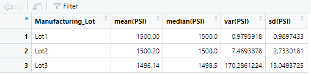

# MechaCar_Statistical_Analysis Module 12 UofT Data bootcamp

## Overview

## Linear Regression to Predict MPG

Plugging in MPG as the dependent variable and the other 5 as independent variables into R's linear regression analysis we get the result:

> summary(lm(mpg ~ vehicle_length + vehicle_weight + spoiler_angle + ground_clearance + AWD , data=MechaCar))

Call:
lm(formula = mpg ~ vehicle_length + vehicle_weight + spoiler_angle + 
    ground_clearance + AWD, data = MechaCar)

Residuals:
     Min       1Q   Median       3Q      Max 
-19.4701  -4.4994  -0.0692   5.4433  18.5849 

	Coefficients:
			   Estimate Std. Error t value Pr(>|t|)    
	(Intercept)      -1.040e+02  1.585e+01  -6.559 5.08e-08 ***
	vehicle_length    6.267e+00  6.553e-01   9.563 2.60e-12 ***
	vehicle_weight    1.245e-03  6.890e-04   1.807   0.0776 .  
	spoiler_angle     6.877e-02  6.653e-02   1.034   0.3069    
	ground_clearance  3.546e+00  5.412e-01   6.551 5.21e-08 ***
	AWD              -3.411e+00  2.535e+00  -1.346   0.1852    
	---
	Signif. codes:  0 ‘***’ 0.001 ‘**’ 0.01 ‘*’ 0.05 ‘.’ 0.1 ‘ ’ 1

Residual standard error: 8.774 on 44 degrees of freedom
Multiple R-squared:  0.7149,	Adjusted R-squared:  0.6825 
F-statistic: 22.07 on 5 and 44 DF,  p-value: 5.35e-11

- Which variables provided a non-random amount of variance to the mpg values in the dataset?
vehicle_length and ground clearance
- Is the slope of the linear model considered to be zero? Why or why not?
The slope of the linear model is not zero. As the null hypothesis is the the slope being zero and the p-value is very low; therefore, we reject the null hypothesis.
- Does this linear model predict MPG of MechaCar prototypes effectively? Why or Why not?
The R-squared value is 0.7149 which is high on the scale between 0 and 1. A high R-squared value suggest that the model is an effective predictor of MPG.

Examining the data further
Correlation
> cor(Mecha_matrix)
                 vehicle_length vehicle_weight spoiler_angle ground_clearance         AWD
mpg                  0.60947984     0.09068314   -0.02083999       0.32874886 -0.14166977

Normality test
	Shapiro-Wilk normality test

data:  MechaCar$vehicle_length
W = 0.93421, p-value = 0.008003

Adjusting the vehicle_length for normality and focusing on the variables with correlation the model was run again and the results are

> MechaCar <- MechaCar%>% mutate(vehicle_length=log2(vehicle_length))
> summary(lm(mpg ~ vehicle_length  + ground_clearance, data=MechaCar))

Call:
lm(formula = mpg ~ vehicle_length + ground_clearance, data = MechaCar)

Residuals:
    Min      1Q  Median      3Q     Max 
-17.416  -7.756   1.933   6.402  17.650 

	Coefficients:
			  Estimate Std. Error t value Pr(>|t|)    
	(Intercept)      -254.8815    31.4420  -8.106 1.77e-10 ***
	vehicle_length     65.3518     7.3196   8.928 1.09e-11 ***
	ground_clearance    3.5684     0.5444   6.555 3.87e-08 ***
	---
	Signif. codes:  0 ‘***’ 0.001 ‘**’ 0.01 ‘*’ 0.05 ‘.’ 0.1 ‘ ’ 1

Residual standard error: 9.145 on 47 degrees of freedom
Multiple R-squared:  0.6692,	Adjusted R-squared:  0.6551 
F-statistic: 47.53 on 2 and 47 DF,  p-value: 5.136e-12

## Summary Statistics on Suspension Coils

  
Total Summary

 
Lot Summary

The design specifications for the MechaCar suspension coils dictate that the variance of the suspension coils must not exceed 100 pounds per square inch. Does the current manufacturing data meet this design specification for all manufacturing lots in total and each lot individually? Why or why not?

Lot 1 and Lot 2 meet the required variance specification but Lot 3 has a variance that exceeds 100 PSI.

## T-test on Suspension Coils

T-test were performed on the Suspension coil results and on the results on individual results:

> t.test(SusCoil$PSI, mu=1500)

	One Sample t-test

data:  SusCoil$PSI
t = -1.8931, df = 149, p-value = 0.06028
alternative hypothesis: true mean is not equal to 1500
95 percent confidence interval:
 1497.507 1500.053
sample estimates:
mean of x 
  1498.78 

> t.test(subset(SusCoil$PSI, SusCoil$Manufacturing_Lot == 'Lot1'),mu=1500)

	One Sample t-test

data:  subset(SusCoil$PSI, SusCoil$Manufacturing_Lot == "Lot1")
t = 0, df = 49, p-value = 1
alternative hypothesis: true mean is not equal to 1500
95 percent confidence interval:
 1499.719 1500.281
sample estimates:
mean of x 
     1500 

> t.test(subset(SusCoil$PSI, SusCoil$Manufacturing_Lot == 'Lot2'),mu=1500)

	One Sample t-test

data:  subset(SusCoil$PSI, SusCoil$Manufacturing_Lot == "Lot2")
t = 0.51745, df = 49, p-value = 0.6072
alternative hypothesis: true mean is not equal to 1500
95 percent confidence interval:
 1499.423 1500.977
sample estimates:
mean of x 
   1500.2 

> t.test(subset(SusCoil$PSI, SusCoil$Manufacturing_Lot == 'Lot3'),mu=1500)

	One Sample t-test

data:  subset(SusCoil$PSI, SusCoil$Manufacturing_Lot == "Lot3")
t = -2.0916, df = 49, p-value = 0.04168
alternative hypothesis: true mean is not equal to 1500
95 percent confidence interval:
 1492.431 1499.849
sample estimates:
mean of x 
  1496.14 

In aggregate the results are in line with the population mean of 1,500 PSI. Examining the individual lots, Lot 3 is the only lot with a p-value of less than 0.05. For Lot 3, we are to reject the null hypothesis that it has a population mean equal to 1500.

## Study Design: MechaCar vs Competition

There are various ways we can quantify how MechaCar performs against the competition. Metrics such as city or highway fuel efficiency, horse power and maintenace costs could be put through a 2 sample t test to determine if the population means are the same. The null hypothesis would be the metric is same for both types of vehicles and the alternative is that they are differenct. If the population means are statistically different than that metric could be used to compare MechaCar with the competiton. The data needed would be from the testing of the vehicles for fuel efficiency, horse power and maintenance costs.

